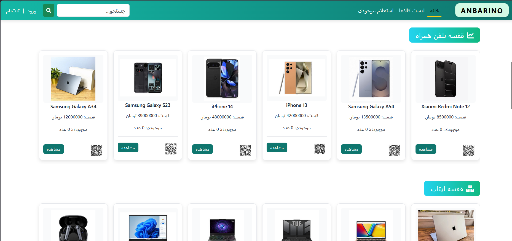

# 📦 Anbarino - Warehouse Management System

Anbarino is a secure, lightweight, and dockerized Warehouse Management System built with **Django**. It is designed to track inventory, manage stock movements, and control warehouse operations efficiently with advanced search capabilities.

## ✨ Features
*   **Advanced Search:** Powered by **Elasticsearch** for lightning-fast and accurate product lookups.
*   **Inventory Tracking:** Add, edit, and delete products seamlessly.
*   **Stock Management:** Monitor real-time stock in/out operations.
*   **Transaction Logs:** View detailed histories of all product movements.
*   **Role-based Access:** Secure user and admin authorization levels.
*   **Dockerized:** Completely containerized for consistent deployment.

## 🛠 Tech Stack
*   **Backend:** Python, Django
*   **Search Engine:** Elasticsearch
*   **Deployment:** Docker, Docker Compose
*   **Architecture:** Monolithic, Environment Variable configurations

## 📸 Screenshots


## 🐳 Quick Start (Docker)

You can easily run the entire stack (Django application and Elasticsearch) using Docker.

### 1. Clone the repository
```bash
git clone https://github.com/rootmamad/anbarino.git
cd anbarino
```

### 2. Set up Environment Variables
Create a `.env` file in the root directory:

```bash
cp .env.example .env
```

Update the `.env` file with your specific `SECRET_KEY` and other configurations.

### 3. Build and Run Container
Run the following command to build the Docker image and start the services via Docker Compose:

```bash
docker compose up -d --build
```

### 4. Apply Migrations & Create Superuser
Once the containers are up, run database migrations and create an admin account:
```bash
docker compose exec web python manage.py migrate
docker compose exec web python manage.py createsuperuser
```

### 5. Load Sample Products (Optional)
If you want to populate the database with initial products, run:

```bash
docker compose exec web python manage.py loaddata fixtures/products.json
```

The application will be accessible at `http://localhost:8000`.

## 🔒 Security
*   Debug mode is disabled for production readiness.
*   Sensitive data and configuration parameters are loaded securely via `.env`.


---

## 🙏 Final Note

Thanks for checking out Anbarino!  
Wishing you success, growth, and great ideas ahead. 🚀
